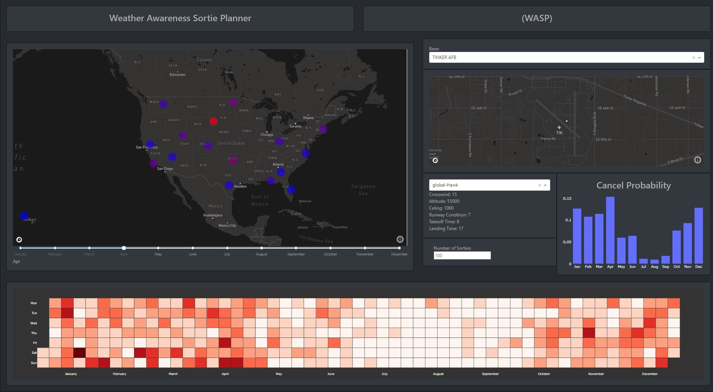

# Weather Awareness Sortie Planner (WASP)
An application to help correlate weather data with when you should plan sorties


## Problem Statement
Sorties are often planned without much data/insight as to how weather has historically affected launches.
We propose a simple open platform that will ingest historical weather data, and show data along with a 'heatmap' of ideal timeframes for when to launch sorties to prevent interference from weather.



## Data Sources Used
https://climate.af.mil and the 14th weather squadron
https://noaa.org

## How to run
### WARNING: You will need base_weather_data.csv and place it into /data/ in order for the Sqllite databse to populate. (Create database function from /API/ is called to create the database). This is required before you can run the project and is also why the CI in the actions is failing.

DOCKER
From the root directory of the repository, run
```docker-compose up```

LOCAL
From the ./wasp directory
```python manage.py```
LOCAL TESTS
```python manage.py test```

### Access the GUI
Find the port used in mange.py or in the docker-compose.yml file.
Example if docker compose was used: Go to browser and type ```http://localhost:8000```

## Explanation of Folders/files
./wasp : houses the heatmap and wasp python applications

./wasp/wasp : houses the base python application, defining routes and other general structures

./wasp/heatmap : houses python application for the heatmap

./wasp/heatmap/plotly_app.py : houses most of the code for the heatmap page

./data : houses our example data that is used by our sqllite database

## Considerations for Air Gapped Environments and Cloud Deployments
Docker compose will create a container image that you can use in Docker, K8s, or any other container hosting software.
In projects without external dependencies (IE F12 -> network in browser doesn't show external network calls) you can just transfer a container image to air gapped environments and it generally will work.
Currently our maps and graphs provider (Plotly) has external dependencies for map images and html elements. Plotly does have an enterprise solution which can be hosted in its own network, which would help consolidate dependencies for air gapped deployments, but this is a paid solution.
All weather data and aircraft data used is publically available.

## Future Ideas
- Improvements to data storage. Our sqllite database solution worked for our hackathon but can be greatly expanded to be included in a docker deployment (postgres included in docker compose as example)'
- Convert the project to NPM to help reduce the amount of remote libraries accessed by the application
- Change maps provider to something that can be hosted locally to aid in air-gapped deployments
- Formal REST APIs allowing for CRUD operations with the database.
